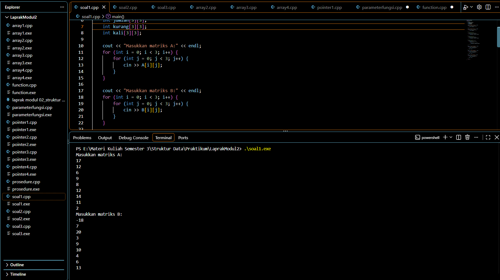
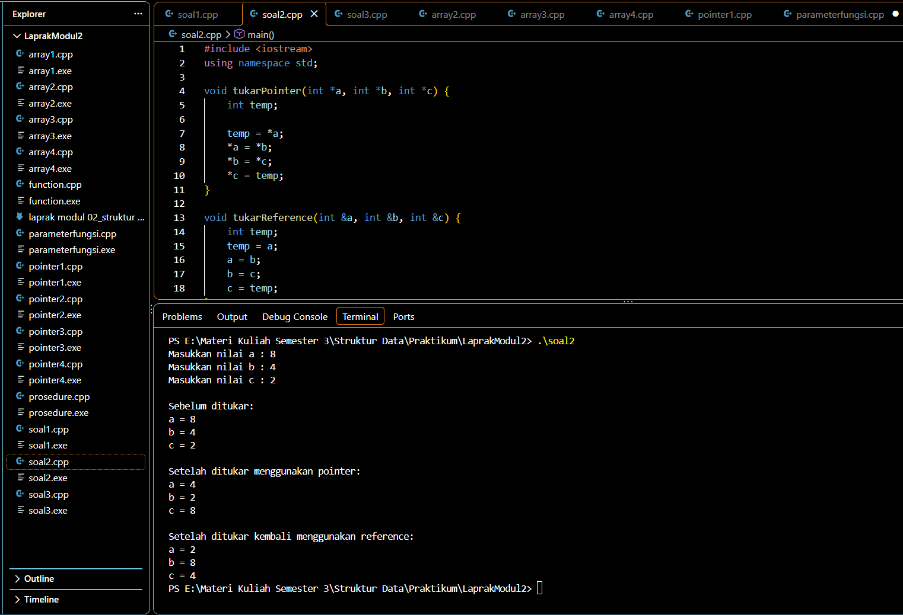

# LAPORAN PRAKTIKUM STRUKTUR DATA
## Profil Mahasiswa

| Keterangan | Data |
|---|---|
| **Nama** | Rakhmat Pratama |
| **NIM** | 109082530037 |
| **Kelas** | S1IF-13-01 |
| **Program Studi** | S1 Informatika |
| **Fakultas** | Fakultas Informatika |
| **Perguruan Tinggi** | Telkom University Purwokerto |


## Modul 02 --- Array, Pointer, Function, Parameter, dan Procedure
**Mata Kuliah:** Praktikum Struktur Data\
**Universitas:** Telkom University\
**Modul:** 02\
**Topik:** Array, Pointer, Function, Parameter Fungsi, dan Procedure

------------------------------------------------------------------------

## A. Pendahuluan

Praktikum Modul 02 membahas dasar pengolahan data menggunakan **array**,
**pointer**, **function**, **parameter fungsi**, dan **procedure** pada
bahasa C++. Bagian guided dikerjakan secara berurutan mulai dari
`array1` sampai `array4`, kemudian `pointer1` sampai `pointer4`, lalu
materi `function`, `parameterfungsi`, dan `procedure`.

Urutan tersebut penting karena setiap program memperkenalkan konsep yang
menjadi dasar untuk program berikutnya. Array digunakan untuk menyimpan
sekumpulan data dalam satu nama variabel, pointer digunakan untuk
menyimpan alamat memori dan mengakses data melalui alamat tersebut,
sedangkan function dan procedure digunakan untuk memecah program menjadi
bagian-bagian yang lebih terstruktur dan dapat digunakan kembali.

Pada bagian unguided, konsep-konsep tersebut diterapkan untuk
menyelesaikan tiga soal Latihan Modul 2 Praktikum Struktur Data. Solusi
dibuat dengan gaya yang tetap mengikuti materi dan pola coding pada
guided, sehingga tidak menggunakan konsep yang berada di luar pembahasan
utama modul.

------------------------------------------------------------------------

# B. GUIDED

## 1. Guided Array 1 --- Array Satu Dimensi

### Coding

``` cpp
#include <iostream>
using namespace std;

int main() {
    int nilai[5];

    nilai[0] = 80;
    nilai[1] = 85;
    nilai[2] = 90;
    nilai[3] = 75;
    nilai[4] = 95;

    for (int i = 0; i < 5; i++) {
        cout << "index ke-" << i << " = " << nilai[i] << endl;
    }

    return 0;
}
```

### Penjelasan

Program `array1.cpp` merupakan contoh paling dasar dari **array satu
dimensi**. Array `nilai[5]` digunakan untuk menyimpan lima buah nilai
integer dalam satu variabel. Karena array memiliki lima elemen, indeks
yang digunakan dimulai dari `0` sampai `4`. Nilai kemudian dimasukkan
satu per satu melalui `nilai[0]` sampai `nilai[4]`.

Setelah data tersimpan, program menggunakan perulangan `for` untuk
menampilkan seluruh isi array. Variabel `i` berfungsi sebagai indeks
array dan akan berubah dari `0` sampai `4`. Dengan demikian, program
tidak perlu menulis `cout` secara berulang untuk setiap elemen. Konsep
utama dari program ini adalah bahwa satu nama array dapat digunakan
untuk menyimpan banyak data dengan tipe yang sama.

### Konsep yang Dipelajari

-   Array satu dimensi.
-   Indeks array dimulai dari `0`.
-   Penyimpanan beberapa data dengan satu nama variabel.
-   Pengaksesan elemen menggunakan `nilai[i]`.
-   Perulangan `for` untuk menampilkan seluruh elemen.

------------------------------------------------------------------------

## 2. Guided Array 2 --- Array Dua Dimensi

### Coding

``` cpp
#include <iostream>
using namespace std;

int main() {
    int nilai[3][3] = {
        {80, 85, 90},
        {75, 80, 85},
        {90, 95, 100}
    };

    // for (int i = 0; i < 3; i++) {
    //     for (int j = 0; j < 3; j++) {
    //         cout << nilai[i][j] << " ";
    //     }
    //     cout << endl;
    // }

    cout << nilai[0][0] << endl; // 80
    cout << nilai[1][1] << endl; // 80
    cout << nilai[2][2] << " ";  // 100

    return 0;
}
```

### Penjelasan

Program `array2.cpp` memperkenalkan **array dua dimensi** dengan ukuran
`3 x 3`. Array ini dapat dibayangkan seperti tabel yang mempunyai tiga
baris dan tiga kolom. Data disimpan menggunakan dua indeks, yaitu indeks
baris dan indeks kolom, sehingga akses dilakukan menggunakan bentuk
`nilai[i][j]`.

Pada program terdapat contoh nested `for`, yaitu `for` di dalam `for`,
yang sebenarnya dapat digunakan untuk menampilkan seluruh isi matriks.
Bagian tersebut masih dikomentari, sehingga tidak dijalankan. Program
yang aktif hanya menampilkan tiga elemen tertentu, yaitu `nilai[0][0]`,
`nilai[1][1]`, dan `nilai[2][2]`. Ketiganya merupakan elemen pada
diagonal utama matriks.

### Konsep yang Dipelajari

-   Array dua dimensi.
-   Baris dan kolom.
-   Penggunaan dua indeks.
-   Nested loop untuk mengakses matriks.
-   Akses elemen tertentu menggunakan `nilai[baris][kolom]`.

------------------------------------------------------------------------

## 3. Guided Array 3 --- Array Tiga Dimensi

### Coding

``` cpp
#include <iostream>
using namespace std;

int main() {
    int data[2][3][3] = {
        {
            {1, 2, 3},
            {4, 5, 6},
            {7, 8, 9}
        },
        {
            {10, 11, 12},
            {13, 14, 15},
            {16, 17, 18}
        }
    };

    // for (int i = 0; i < 2; i++) {
    //     for (int j = 0; j < 3; j++) {
    //         for (int k = 0; k < 3; k++) {
    //             cout << data[i][j][k] << " ";
    //         }
    //         cout << endl;
    //     }
    //     cout << endl;
    // }

    cout << data[0][1][1] << " "; // 5

    return 0;
}
```

### Penjelasan

Program `array3.cpp` mengembangkan konsep array menjadi **tiga
dimensi**. Array `data[2][3][3]` mempunyai tiga indeks. Indeks pertama
menunjukkan kelompok atau lapisan, indeks kedua menunjukkan baris, dan
indeks ketiga menunjukkan kolom. Dengan demikian, terdapat dua kelompok
yang masing-masing mempunyai matriks berukuran `3 x 3`.

Untuk mengakses elemen tertentu digunakan tiga indeks, misalnya
`data[0][1][1]`. Artinya program mengambil data pada kelompok pertama,
baris kedua, dan kolom kedua. Nilai tersebut adalah `5`. Bagian nested
loop tiga tingkat juga menunjukkan bagaimana seluruh isi array tiga
dimensi dapat ditampilkan.

### Konsep yang Dipelajari

-   Array tiga dimensi.
-   Penggunaan tiga indeks.
-   Nested loop tiga tingkat.
-   Akses data menggunakan `data[i][j][k]`.

------------------------------------------------------------------------

## 4. Guided Array 4 --- Array Empat Dimensi

### Coding

``` cpp
#include <iostream>
using namespace std;

int main() {
    int data[2][2][2][2] = {
        {
            {
                {1, 2},
                {3, 4}
            },
            {
                {5, 6},
                {7, 8}
            }
        },
        {
            {
                {9, 10},
                {11, 12}
            },
            {
                {13, 14},
                {15, 16}
            }
        }
    };

    cout << data[0][0][0][0] << endl; // 1
    cout << data[1][1][1][1] << endl; // 16

    return 0;
}
```

### Penjelasan

Program `array4.cpp` menunjukkan **array empat dimensi**. Deklarasi
`data[2][2][2][2]` berarti data memiliki empat tingkat indeks. Karena
terdapat empat indeks, pengaksesan satu elemen juga membutuhkan empat
indeks, misalnya `data[1][1][1][1]`.

Program menampilkan dua elemen untuk memperlihatkan cara kerja indeks
pada array berdimensi banyak. `data[0][0][0][0]` menghasilkan `1`,
sedangkan `data[1][1][1][1]` menghasilkan `16`. Program ini merupakan
pengembangan dari array satu, dua, dan tiga dimensi yang telah
dipelajari sebelumnya.

### Konsep yang Dipelajari

-   Array empat dimensi.
-   Empat tingkat indeks.
-   Pengaksesan elemen menggunakan empat indeks.
-   Struktur array berdimensi banyak.

------------------------------------------------------------------------

# 5. Guided Pointer 1 --- Nilai dan Alamat Memori

### Coding

``` cpp
#include <iostream>
using namespace std;

int main() {
    char a;
    int j;
    char arr[6];

    arr[3] = 'b';
    a = 'u';
    j = 10;

    cout << a << endl;       // u
    cout << &a << endl;      // alamat memory atau address

    cout << j << endl;       // 10
    cout << &j << endl;      // alamat memory atau address

    cout << arr[3] << endl;  // value
    cout << &(arr[4]) << endl; // alamat memory atau address

    return 0;
}
```

### Penjelasan

Program `pointer1.cpp` memperkenalkan konsep **alamat memori**. Variabel
`a` bertipe `char`, `j` bertipe `int`, dan `arr` merupakan array
karakter. Operator `&` digunakan untuk mendapatkan alamat memori dari
sebuah variabel. Oleh karena itu, `cout << &a` tidak menampilkan isi
karakter `a`, tetapi menampilkan alamat tempat variabel tersebut
disimpan di memori.

Pada array, `arr[3]` digunakan untuk mengakses nilai pada indeks keempat
karena indeks array dimulai dari `0`. Sementara itu, `&(arr[4])`
digunakan untuk mendapatkan alamat memori elemen `arr[4]`. Program ini
menjadi dasar sebelum masuk ke pembahasan pointer yang benar-benar
menyimpan alamat sebuah variabel.

### Konsep yang Dipelajari

-   Alamat memori.
-   Operator `&`.
-   Perbedaan nilai dan alamat.
-   Hubungan array dengan alamat memori.

------------------------------------------------------------------------

# 6. Guided Pointer 2 --- Pointer Menunjuk Variabel

### Coding

``` cpp
#include <iostream>
using namespace std;

int main() {
    int x, y;
    int *px;

    x = 87;
    px = &x;
    y = *px;

    cout << "Alamat x = " << &x << endl;
    cout << "Isi px = " << px << endl;
    cout << "Isi x = " << x << endl;
    cout << "Nilai yang ditunjuk px = " << *px << endl;
    cout << "Nilai y = " << y << endl;

    return 0;
}
```

### Penjelasan

Program `pointer2.cpp` memperlihatkan cara sebuah pointer digunakan
untuk menyimpan alamat variabel. `px` dideklarasikan sebagai pointer
bertipe `int`, sehingga dapat menyimpan alamat dari variabel integer.
Setelah `x` diberi nilai `87`, perintah `px = &x` membuat `px` menyimpan
alamat memori dari `x`.

Operator `*` pada `*px` digunakan untuk mendapatkan nilai yang berada
pada alamat yang ditunjuk oleh pointer. Karena `px` menunjuk ke `x`,
maka `*px` menghasilkan nilai `87`. Kemudian nilai tersebut disimpan ke
variabel `y`. Dengan demikian, program memperlihatkan hubungan antara
variabel, alamat variabel, pointer, dan nilai yang ditunjuk pointer.

### Konsep yang Dipelajari

-   Deklarasi pointer.
-   Operator alamat `&`.
-   Operator dereference `*`.
-   Pointer menyimpan alamat variabel.
-   `*px` digunakan untuk mengambil nilai yang ditunjuk pointer.

------------------------------------------------------------------------

# 7. Guided Pointer 3 --- Array Satu Dimensi dan Dua Dimensi

### Coding

``` cpp
#include <iostream>
#define MAX 5
using namespace std;

int main() {
    int i, j;
    float nilai_total, rata_rata;
    float nilai[MAX];

    static int nilai_tahun[MAX][MAX] = {
        {0, 2, 2, 0, 0},
        {0, 1, 1, 1, 0},
        {0, 3, 3, 3, 0},
        {4, 4, 0, 0, 4},
        {5, 0, 0, 0, 5}
    };

    // inisialisasi array satu dimensi
    for (i = 0; i < MAX; i++) {
        cout << "masukkan nilai ke-" << i + 1 << endl;
        cin >> nilai[i];
    }

    cout << "\ndata nilai siswa :\n";

    // menampilkan array satu dimensi
    for (i = 0; i < MAX; i++)
        cout << "nilai ke-" << i + 1 << "=" << nilai[i] << endl;

    cout << "\n nilai tahunan : \n";

    // menampilkan array dua dimensi
    for (i = 0; i < MAX; i++) {
        for (j = 0; j < MAX; j++)
            cout << nilai_tahun[i][j];

        cout << "\n";
    }

    return 0;
}
```

### Penjelasan

Program `pointer3.cpp` memperlihatkan penggunaan array satu dimensi dan
array dua dimensi dalam satu program. Konstanta `MAX` diberi nilai `5`,
sehingga array `nilai[MAX]` mempunyai lima elemen. Program meminta
pengguna memasukkan lima nilai siswa menggunakan perulangan `for`,
kemudian menampilkan kembali nilai tersebut.

Selain itu terdapat `nilai_tahun[MAX][MAX]` yang merupakan array dua
dimensi berukuran `5 x 5`. Data array tersebut sudah diinisialisasi di
awal program. Dua buah perulangan digunakan untuk menampilkan seluruh
isi array dua dimensi. Program ini memperkuat pemahaman tentang
penggunaan indeks pada array satu dimensi dan dua dimensi serta
penggunaan perulangan untuk memproses banyak data.

### Konsep yang Dipelajari

-   Konstanta dengan `#define`.
-   Array satu dimensi.
-   Array dua dimensi.
-   Input data menggunakan `cin`.
-   Nested loop untuk array dua dimensi.

------------------------------------------------------------------------

# 8. Guided Pointer 4 --- String dan Array Karakter

### Coding

``` cpp
#include <iostream>
using namespace std;

int main() {
    char nama[] = "strukdat";

    cout << nama << endl;
    cout << nama[3] << endl;

    return 0;
}
```

### Penjelasan

Program `pointer4.cpp` menggunakan array bertipe `char` untuk menyimpan
teks `"strukdat"`. Dalam C++, kumpulan karakter seperti ini dapat
digunakan untuk merepresentasikan string gaya C. Ketika `cout << nama`
digunakan, seluruh karakter dalam array ditampilkan sebagai satu teks.

Sementara itu, `nama[3]` hanya mengambil satu karakter pada indeks
keempat. Karena indeks dimulai dari `0`, karakter pada indeks `0` adalah
`s`, indeks `1` adalah `t`, indeks `2` adalah `r`, dan indeks `3` adalah
`u`. Jadi output kedua adalah karakter `u`.

### Konsep yang Dipelajari

-   Array karakter.
-   String.
-   Akses karakter berdasarkan indeks.
-   Hubungan array dengan penyimpanan teks.

------------------------------------------------------------------------

# 9. Guided Function --- Fungsi `maks3`

### Coding

``` cpp
#include <iostream>
using namespace std;

int maks3(int a, int b, int c);

int main() {
    int x, y, z;

    cout << "Masukkan nilai bilangan ke-1 = ";
    cin >> x;

    cout << "Masukkan nilai bilangan ke-2 = ";
    cin >> y;

    cout << "Masukkan nilai bilangan ke-3 = ";
    cin >> z;

    cout << "Nilai maksimumnya adalah = " << maks3(x, y, z);

    return 0;
}

int maks3(int a, int b, int c) {
    int temp_max = a;

    if (b > temp_max)
        temp_max = b;

    if (c > temp_max)
        temp_max = c;

    return temp_max;
}
```

### Penjelasan

Program `function.cpp` memperkenalkan konsep **function** atau fungsi.
Fungsi `maks3()` dibuat untuk mencari nilai terbesar dari tiga buah
bilangan. Prototype `int maks3(int a, int b, int c);` diletakkan sebelum
`main()` agar compiler mengetahui bahwa fungsi tersebut tersedia.

Di dalam `main()`, pengguna memasukkan tiga nilai melalui `x`, `y`, dan
`z`. Ketiga nilai tersebut dikirim sebagai argumen ketika
`maks3(x, y, z)` dipanggil. Di dalam fungsi, `temp_max` pertama kali
berisi nilai `a`. Kemudian nilai `b` dibandingkan dengan `temp_max`,
lalu nilai `c` juga dibandingkan. Jika ditemukan nilai yang lebih besar,
`temp_max` diperbarui. Setelah proses selesai, fungsi mengembalikan
nilai terbesar menggunakan `return`.

### Konsep yang Dipelajari

-   Prototype fungsi.
-   Pemanggilan fungsi.
-   Parameter fungsi.
-   Nilai balik `return`.
-   Variabel lokal.
-   Percabangan `if`.

------------------------------------------------------------------------

# 10. Guided Parameter Function --- Call by Value, Pointer, dan Reference

### Coding

``` cpp
#include <iostream>
using namespace std;

void tukarValue(int x, int y) {
    int temp = x;
    x = y;
    y = temp;
}

void tukarPointer(int *x, int *y) {
    int temp = *x;
    *x = *y;
    *y = temp;
}

void tukarReference(int &x, int &y) {
    int temp = x;
    x = y;
    y = temp;
}

int main() {
    int a = 4, b = 6;

    tukarValue(a, b);
    cout << "Setelah Call by Value -> a = " << a
         << ", b = " << b << " (Tetap)" << endl;

    tukarPointer(&a, &b);
    cout << "Setelah Call by Pointer -> a = " << a
         << ", b = " << b << " (Berubah!)" << endl;

    tukarReference(a, b);
    cout << "Setelah Call by Reference -> a = " << a
         << ", b = " << b << " (Berubah lagi!)" << endl;

    return 0;
}
```

### Penjelasan

Program `parameterfungsi.cpp` membandingkan tiga cara pengiriman
parameter, yaitu **call by value**, **call by pointer**, dan **call by
reference**. Pada `tukarValue`, nilai `a` dan `b` dikirim sebagai
salinan. Oleh karena itu, perubahan yang dilakukan di dalam fungsi hanya
terjadi pada salinan dan nilai variabel asli tetap.

Pada `tukarPointer`, parameter berupa pointer sehingga fungsi menerima
alamat dari variabel. Pemanggilan dilakukan menggunakan `&a` dan `&b`.
Di dalam fungsi, operator `*` digunakan untuk mengubah nilai pada alamat
tersebut sehingga nilai asli `a` dan `b` berubah.

Pada `tukarReference`, parameter menggunakan tanda `&` pada
deklarasinya. Fungsi bekerja langsung terhadap variabel yang dikirim
sehingga perubahan juga terjadi pada variabel asli. Program ini penting
karena menjadi dasar pemahaman ketika suatu fungsi perlu mengubah data
yang berada di luar fungsi.

### Perbedaan Utama

  Metode              Parameter   Pemanggilan              Nilai asli berubah?
  ------------------- ----------- ------------------------ ---------------------
  Call by Value       `int x`     `tukarValue(a, b)`       Tidak
  Call by Pointer     `int *x`    `tukarPointer(&a, &b)`   Ya
  Call by Reference   `int &x`    `tukarReference(a, b)`   Ya

------------------------------------------------------------------------

# 11. Guided Procedure --- Procedure `tulis`

### Coding

``` cpp
#include <iostream>
using namespace std;

void tulis(int x);

int main() {
    int jum;

    cout << "jumlah baris kata = ";
    cin >> jum;

    tulis(jum);

    return 0;
}

void tulis(int x) {
    for (int i = 0; i < x; i++)
        cout << "baris ke-" << i + 1 << endl;
}
```

### Penjelasan

Program `procedure.cpp` memperkenalkan **procedure**, yaitu fungsi yang
menggunakan tipe `void` sehingga tidak mengembalikan nilai dengan
`return`. Prototype `void tulis(int x);` diletakkan sebelum `main()`,
kemudian fungsi tersebut dipanggil setelah pengguna memasukkan jumlah
baris.

Fungsi `tulis()` menerima parameter `x` yang menunjukkan berapa kali
teks harus ditampilkan. Perulangan `for` berjalan dari `0` sampai kurang
dari `x`. Pada setiap perulangan, program menampilkan nomor baris dengan
`i + 1` agar tampilan dimulai dari baris ke-1. Program ini menunjukkan
bagaimana sebuah tugas tertentu dapat dipisahkan ke dalam procedure
sehingga `main()` menjadi lebih terstruktur.

### Konsep yang Dipelajari

-   Procedure menggunakan `void`.
-   Prototype procedure.
-   Parameter procedure.
-   Pemanggilan procedure.
-   Perulangan `for`.

------------------------------------------------------------------------

# C. UNGUIDED / LATIHAN MODUL 2

## Nomor 1 --- Operasi Matriks 3 × 3

### Soal

Buat program untuk melakukan operasi terhadap dua matriks berukuran
`3 x 3`, yaitu:

1.  Penjumlahan matriks.
2.  Pengurangan matriks.
3.  Perkalian matriks.

Program menggunakan konsep array dua dimensi dan perulangan.

### Materi yang Digunakan

Soal ini berhubungan langsung dengan **Guided Array 2**, karena matriks
direpresentasikan menggunakan array dua dimensi `A[3][3]` dan `B[3][3]`.

### Coding

``` cpp
#include <iostream>
using namespace std;

int main() {
    int A[3][3], B[3][3];
    int jumlah[3][3];
    int kurang[3][3];
    int kali[3][3];

    cout << "Masukkan matriks A:" << endl;
    for (int i = 0; i < 3; i++) {
        for (int j = 0; j < 3; j++) {
            cin >> A[i][j];
        }
    }

    cout << "Masukkan matriks B:" << endl;
    for (int i = 0; i < 3; i++) {
        for (int j = 0; j < 3; j++) {
            cin >> B[i][j];
        }
    }

    // Penjumlahan matriks
    for (int i = 0; i < 3; i++) {
        for (int j = 0; j < 3; j++) {
            jumlah[i][j] = A[i][j] + B[i][j];
        }
    }

    // Pengurangan matriks
    for (int i = 0; i < 3; i++) {
        for (int j = 0; j < 3; j++) {
            kurang[i][j] = A[i][j] - B[i][j];
        }
    }

    // Perkalian matriks
    for (int i = 0; i < 3; i++) {
        for (int j = 0; j < 3; j++) {
            kali[i][j] = 0;

            for (int k = 0; k < 3; k++) {
                kali[i][j] += A[i][k] * B[k][j];
            }
        }
    }

    cout << "\nHasil Penjumlahan:" << endl;
    for (int i = 0; i < 3; i++) {
        for (int j = 0; j < 3; j++) {
            cout << jumlah[i][j] << " ";
        }
        cout << endl;
    }

    cout << "\nHasil Pengurangan:" << endl;
    for (int i = 0; i < 3; i++) {
        for (int j = 0; j < 3; j++) {
            cout << kurang[i][j] << " ";
        }
        cout << endl;
    }

    cout << "\nHasil Perkalian:" << endl;
    for (int i = 0; i < 3; i++) {
        for (int j = 0; j < 3; j++) {
            cout << kali[i][j] << " ";
        }
        cout << endl;
    }

    return 0;
}
```

### Contoh Data Input

Matriks A:

``` text
1 2 3
4 5 6
7 8 9
```

Matriks B:

``` text
9 8 7
6 5 4
3 2 1
```

### Screenshot Output


.png)

### Output

``` text
Hasil Penjumlahan:
10 10 10
10 10 10
10 10 10

Hasil Pengurangan:
-8 -6 -4
-2 0 2
4 6 8

Hasil Perkalian:
30 24 18
84 69 54
138 114 90
```

### Penjelasan

Pada bagian penjumlahan, setiap elemen matriks A dijumlahkan dengan
elemen B yang mempunyai posisi sama. Karena itu digunakan dua indeks,
`i` untuk baris dan `j` untuk kolom. Konsep ini sama seperti akses
`nilai[i][j]` pada `array2.cpp`.

Pengurangan dilakukan dengan cara yang sama, tetapi operasi yang
digunakan adalah `A[i][j] - B[i][j]`. Sementara itu, perkalian matriks
membutuhkan tiga perulangan. Indeks `i` menentukan baris matriks A, `j`
menentukan kolom matriks B, dan `k` digunakan untuk menjumlahkan hasil
perkalian elemen yang bersesuaian. Variabel `kali[i][j]` terlebih dahulu
diberi nilai `0` agar dapat digunakan sebagai penampung hasil
penjumlahan.

------------------------------------------------------------------------

# Nomor 2 --- Pointer dan Reference untuk Menukar 3 Variabel

### Soal

Buat program untuk menukar nilai **3 variabel** menggunakan konsep
pointer dan reference.

### Materi yang Digunakan

Soal ini berhubungan dengan `pointer1.cpp`, `pointer2.cpp`, serta guided
`parameterfungsi.cpp`. Konsep utama yang digunakan adalah alamat dengan
`&`, dereference dengan `*`, pointer, dan reference.

### Coding

``` cpp
#include <iostream>
using namespace std;

// Menukar 3 variabel menggunakan pointer
void tukarPointer(int *a, int *b, int *c) {
    int temp;

    temp = *a;
    *a = *b;
    *b = *c;
    *c = temp;
}

// Menukar 3 variabel menggunakan reference
void tukarReference(int &a, int &b, int &c) {
    int temp;

    temp = a;
    a = b;
    b = c;
    c = temp;
}

int main() {
    int a, b, c;

    cout << "Masukkan nilai a : ";
    cin >> a;

    cout << "Masukkan nilai b : ";
    cin >> b;

    cout << "Masukkan nilai c : ";
    cin >> c;

    cout << "\nSebelum ditukar:" << endl;
    cout << "a = " << a << endl;
    cout << "b = " << b << endl;
    cout << "c = " << c << endl;

    tukarPointer(&a, &b, &c);

    cout << "\nSetelah ditukar menggunakan pointer:" << endl;
    cout << "a = " << a << endl;
    cout << "b = " << b << endl;
    cout << "c = " << c << endl;

    tukarReference(a, b, c);

    cout << "\nSetelah ditukar kembali menggunakan reference:" << endl;
    cout << "a = " << a << endl;
    cout << "b = " << b << endl;
    cout << "c = " << c << endl;

    return 0;
}
```

### Contoh Input

``` text
a = 4
b = 6
c = 8
```

### Screenshot Output



### Output

``` text
Sebelum ditukar: a = 4, b = 6, c = 8
Setelah Call by Pointer: a = 6, b = 8, c = 4
Setelah Call by Reference: a = 8, b = 4, c = 6
```

### Penjelasan

Fungsi `tukarPointer()` menerima tiga parameter berupa pointer. Ketika
dipanggil, alamat `a`, `b`, dan `c` diberikan menggunakan operator `&`.
Di dalam fungsi, operator `*` digunakan untuk mengakses nilai yang
berada pada alamat tersebut. Proses pertukaran dilakukan menggunakan
variabel sementara `temp`.

Fungsi `tukarReference()` menggunakan parameter reference. Berbeda
dengan pointer, pemanggilan fungsi tidak perlu menggunakan `&` karena
parameter reference langsung mengacu pada variabel yang diberikan. Kedua
metode tersebut dapat mengubah nilai variabel asli.

Pada contoh, urutan awal adalah `4, 6, 8`. Setelah fungsi pointer
dijalankan, nilainya menjadi `6, 8, 4`. Kemudian ketika fungsi reference
dijalankan kembali, urutannya menjadi `8, 4, 6`. Perubahan tersebut
menunjukkan bahwa kedua metode bekerja terhadap data asli, bukan hanya
salinan data.

------------------------------------------------------------------------

# Nomor 3 --- Array 1 Dimensi, Minimum, Maksimum, Rata-rata, dan Menu

### Soal

Diberikan array:

``` text
arrA = {11, 8, 5, 7, 12, 26, 3, 54, 33, 55}
```

Buat program menggunakan fungsi:

-   `cariMinimum()`
-   `cariMaksimum()`
-   `hitungRataRata()`

Program juga menggunakan menu dengan `switch-case`.

### Materi yang Digunakan

Soal ini menggabungkan beberapa materi guided, terutama:

-   `array1.cpp` untuk array satu dimensi.
-   `function.cpp` untuk pembuatan fungsi dan `return`.
-   `procedure.cpp` sebagai referensi pemisahan proses menjadi bagian
    terstruktur.
-   Konsep `switch-case` untuk menu.

### Coding

``` cpp
#include <iostream>
using namespace std;

int cariMinimum(int arr[], int n) {
    int min = arr[0];

    for (int i = 1; i < n; i++) {
        if (arr[i] < min) {
            min = arr[i];
        }
    }

    return min;
}

int cariMaksimum(int arr[], int n) {
    int max = arr[0];

    for (int i = 1; i < n; i++) {
        if (arr[i] > max) {
            max = arr[i];
        }
    }

    return max;
}

float hitungRataRata(int arr[], int n) {
    int total = 0;

    for (int i = 0; i < n; i++) {
        total += arr[i];
    }

    return (float) total / n;
}

int main() {
    int arrA[10] = {11, 8, 5, 7, 12, 26, 3, 54, 33, 55};
    int pilihan;

    cout << "Data Array:" << endl;

    for (int i = 0; i < 10; i++) {
        cout << arrA[i] << " ";
    }

    cout << endl;

    cout << "\n===== MENU =====" << endl;
    cout << "1. Cari Minimum" << endl;
    cout << "2. Cari Maksimum" << endl;
    cout << "3. Hitung Rata-rata" << endl;
    cout << "4. Keluar" << endl;

    cout << "\nPilih menu: ";
    cin >> pilihan;

    switch (pilihan) {
        case 1:
            cout << "Nilai minimum = "
                 << cariMinimum(arrA, 10) << endl;
            break;

        case 2:
            cout << "Nilai maksimum = "
                 << cariMaksimum(arrA, 10) << endl;
            break;

        case 3:
            cout << "Nilai rata-rata = "
                 << hitungRataRata(arrA, 10) << endl;
            break;

        case 4:
            cout << "Program selesai." << endl;
            break;

        default:
            cout << "Pilihan tidak tersedia." << endl;
    }

    return 0;
}
```

### Screenshot Output

.png)
.png)
.png)
.png)

### Contoh Output untuk Menu 1

``` text
Data Array:
11 8 5 7 12 26 3 54 33 55

===== MENU =====
1. Cari Minimum
2. Cari Maksimum
3. Hitung Rata-rata
4. Keluar

Pilih menu: 1
Nilai minimum = 3
```

### Hasil Perhitungan

  Operasi       Hasil
  ----------- -------
  Minimum           3
  Maksimum         55
  Rata-rata      21.4

### Penjelasan

Array `arrA` merupakan array satu dimensi yang berisi sepuluh data.
Fungsi `cariMinimum()` dimulai dengan menganggap elemen pertama sebagai
nilai minimum. Kemudian setiap elemen berikutnya dibandingkan
menggunakan `if`. Jika ditemukan nilai yang lebih kecil, variabel `min`
diperbarui. Setelah semua elemen diperiksa, fungsi mengembalikan nilai
minimum dengan `return`.

Fungsi `cariMaksimum()` menggunakan konsep yang sama, tetapi mencari
nilai yang lebih besar. Fungsi `hitungRataRata()` menjumlahkan seluruh
elemen array menggunakan perulangan `for`, kemudian hasil total dibagi
jumlah data. Tipe `float` digunakan pada fungsi rata-rata agar hasil
pembagian dapat menghasilkan nilai desimal.

Pada `main()`, pengguna memilih operasi melalui menu. `switch-case`
digunakan untuk menentukan fungsi yang akan dijalankan berdasarkan
pilihan pengguna. Dengan struktur ini, setiap operasi dipisahkan menjadi
fungsi tersendiri sehingga program lebih terstruktur dan sesuai dengan
materi function pada Modul 02.

------------------------------------------------------------------------

# D. Kesimpulan

Dari rangkaian Guided Modul 02 dapat dipahami bahwa array digunakan
untuk menyimpan banyak data dengan tipe yang sama, mulai dari array satu
dimensi sampai array berdimensi banyak. Array satu dimensi menggunakan
satu indeks, sedangkan array dua, tiga, dan empat dimensi menggunakan
jumlah indeks yang sesuai dengan dimensinya.

Pointer memperkenalkan konsep alamat memori dan hubungan antara alamat
dengan nilai yang tersimpan di dalamnya. Operator `&` digunakan untuk
memperoleh alamat, sedangkan `*` digunakan untuk mengambil nilai yang
ditunjuk pointer. Konsep tersebut kemudian digunakan pada parameter
pointer untuk mengubah data asli.

Materi function dan procedure membuat program menjadi lebih terstruktur.
Function dapat mengembalikan nilai menggunakan `return`, sedangkan
procedure menggunakan `void` dan digunakan untuk menjalankan suatu
proses tanpa mengembalikan nilai. Parameter function memungkinkan data
dikirim ke fungsi, dengan perbedaan antara call by value, call by
pointer, dan call by reference.

Ketiga soal unguided menerapkan materi tersebut secara langsung. Soal
pertama menggunakan array dua dimensi untuk operasi matriks, soal kedua
menggunakan pointer dan reference untuk menukar nilai, sedangkan soal
ketiga menggabungkan array satu dimensi, function, perulangan,
percabangan, dan menu `switch-case`.

------------------------------------------------------------------------

## E. Penutup

Laporan ini disusun berdasarkan urutan pembelajaran praktikum Modul 02,
yaitu **Array 1 sampai 4, Pointer 1 sampai 4, Function, Parameter
Function, Procedure, kemudian Latihan/Undguided Modul 02**. Setiap
bagian diberikan penjelasan mengenai fungsi kode dan konsep yang
digunakan agar hubungan antara materi guided dengan soal latihan dapat
terlihat dengan jelas.

## Kesimpulan

Praktikum Struktur Data Modul 2 memberikan pemahaman dasar mengenai cara menyimpan, mengakses, dan mengolah data menggunakan **array, pointer, function, parameter function, dan procedure** pada bahasa C++. Materi guided disusun secara bertahap, dimulai dari array satu dimensi pada `array1.cpp`, kemudian berkembang menjadi array dua dimensi pada `array2.cpp`, array tiga dimensi pada `array3.cpp`, dan array empat dimensi pada `array4.cpp`. Dari rangkaian tersebut dapat dipahami bahwa semakin banyak dimensi yang digunakan, semakin banyak indeks yang diperlukan untuk mengakses sebuah elemen, tetapi prinsip dasarnya tetap sama, yaitu elemen array diakses menggunakan indeks yang dimulai dari `0`.

Materi kemudian dilanjutkan dengan pointer melalui `pointer1.cpp` sampai `pointer4.cpp`. Pada bagian ini dipelajari hubungan antara variabel, nilai, dan alamat memori. Operator `&` digunakan untuk mendapatkan alamat suatu variabel, sedangkan operator `*` digunakan untuk mengakses nilai yang ditunjuk oleh pointer. Konsep tersebut menjadi dasar untuk memahami bagaimana data dapat diakses secara tidak langsung melalui alamat memorinya. Materi pointer juga berkaitan erat dengan array karena array dan pointer memiliki hubungan yang kuat dalam C++, terutama ketika array digunakan sebagai argumen fungsi.

Setelah array dan pointer, praktikum membahas function, parameter function, dan procedure. Function digunakan untuk memecah program menjadi bagian-bagian yang memiliki tugas tertentu sehingga program menjadi lebih terstruktur dan dapat digunakan kembali. Contoh `maks3()` menunjukkan bagaimana sebuah fungsi dapat menerima beberapa parameter, melakukan proses pencarian nilai maksimum, kemudian mengembalikan hasil menggunakan `return`. Pada materi parameter function dipelajari perbedaan **call by value, call by pointer, dan call by reference**. Call by value bekerja dengan menyalin nilai sehingga perubahan di dalam fungsi tidak mengubah variabel asli. Sebaliknya, penggunaan pointer maupun reference memungkinkan fungsi mengakses dan mengubah data yang berada pada variabel pemanggil.

Procedure pada contoh `tulis(int x)` digunakan untuk menjalankan suatu proses tanpa mengembalikan nilai kepada pemanggil karena menggunakan tipe `void`. Dengan demikian, materi function dan procedure melengkapi materi array dan pointer karena data yang disimpan dalam array atau variabel dapat diproses melalui fungsi yang dibuat secara modular.

Pada bagian **Unguided/Latihan Modul 2**, konsep-konsep tersebut diterapkan dalam bentuk permasalahan pemrograman. Penyelesaian soal menggunakan struktur data array, pointer/reference, function, parameter, percabangan, perulangan, dan `switch-case` sesuai kebutuhan masing-masing soal. Hal ini menunjukkan bahwa materi yang dipelajari pada guided bukan hanya contoh kode yang berdiri sendiri, tetapi menjadi dasar untuk menyelesaikan permasalahan pemrograman yang lebih terstruktur.

Secara keseluruhan, Modul 2 membantu membangun pemahaman mengenai hubungan antara **data, indeks, alamat memori, fungsi, dan parameter** dalam C++. Pemahaman terhadap konsep-konsep tersebut menjadi dasar penting untuk mempelajari struktur data yang lebih lanjut, karena banyak struktur data dan algoritma menggunakan array, pointer, serta fungsi sebagai komponen pembentuknya.

## Daftar Pustaka

1. cppreference.com. **Array declaration**. Dokumentasi referensi bahasa C++ mengenai deklarasi array, indeks, array multidimensi, dan hubungan array dengan pointer.  
   https://en.cppreference.com/w/cpp/language/array

2. cppreference.com. **Functions**. Dokumentasi referensi bahasa C++ mengenai deklarasi, definisi, parameter, dan pemanggilan fungsi.  
   https://en.cppreference.com/w/cpp/language/functions

3. cppreference.com. **Pointer declaration**. Dokumentasi referensi bahasa C++ mengenai pointer dan penggunaan alamat serta dereferencing.  
   https://en.cppreference.com/w/cpp/language/pointer

4. Microsoft Learn. **References (C++)**. Dokumentasi mengenai reference pada C++, termasuk deklarasi dan penggunaan reference untuk mengakses objek yang sama.  
   https://learn.microsoft.com/en-us/cpp/cpp/references-cpp

5. GeeksforGeeks. **Arrays in C++**. Materi pengantar mengenai array, indeks array, deklarasi, dan penggunaan array dalam program C++.  
   https://www.geeksforgeeks.org/cpp/cpp-arrays/

6. GeeksforGeeks. **Pointers and References in C++**. Materi mengenai pointer, reference, dereferencing, serta perbedaan dan penggunaan keduanya dalam parameter fungsi.  
   https://www.geeksforgeeks.org/cpp/pointers-vs-references-cpp/

7. GeeksforGeeks. **Pointers vs Array in C++**. Materi mengenai hubungan dan perbedaan array dengan pointer dalam bahasa C++.  
   https://www.geeksforgeeks.org/cpp/pointers-vs-array-in-cpp/

### Kesesuaian Referensi dengan Materi Praktikum

| Materi Praktikum | Referensi yang Relevan |
|---|---|
| Array 1–4 | cppreference – Array declaration; GeeksforGeeks – Arrays in C++ |
| Pointer 1–4 | cppreference – Pointer declaration; GeeksforGeeks – Pointers and References in C++ |
| Hubungan array dan pointer | GeeksforGeeks – Pointers vs Array in C++; cppreference – Array declaration |
| Function | cppreference – Functions |
| Parameter function | cppreference – Functions; GeeksforGeeks – Pointers and References in C++ |
| Call by value, pointer, dan reference | GeeksforGeeks – Pointers and References in C++; Microsoft Learn – References (C++) |
| Procedure / `void` function | cppreference – Functions |
| Latihan Modul 2 | Gabungan konsep array, pointer/reference, function, parameter, perulangan, dan percabangan dari referensi di atas |
